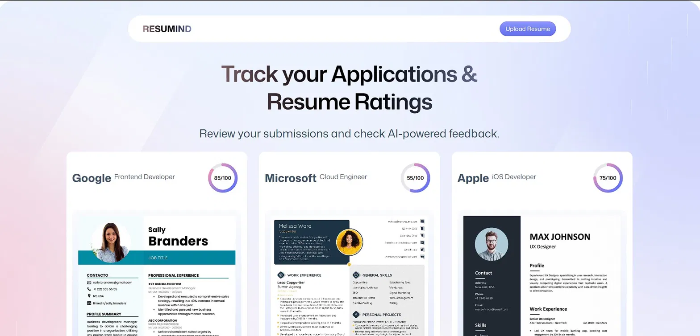
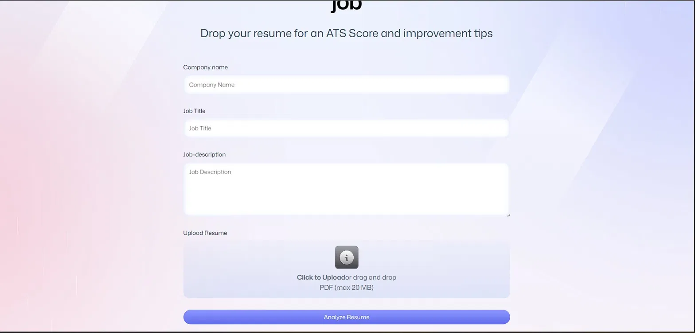
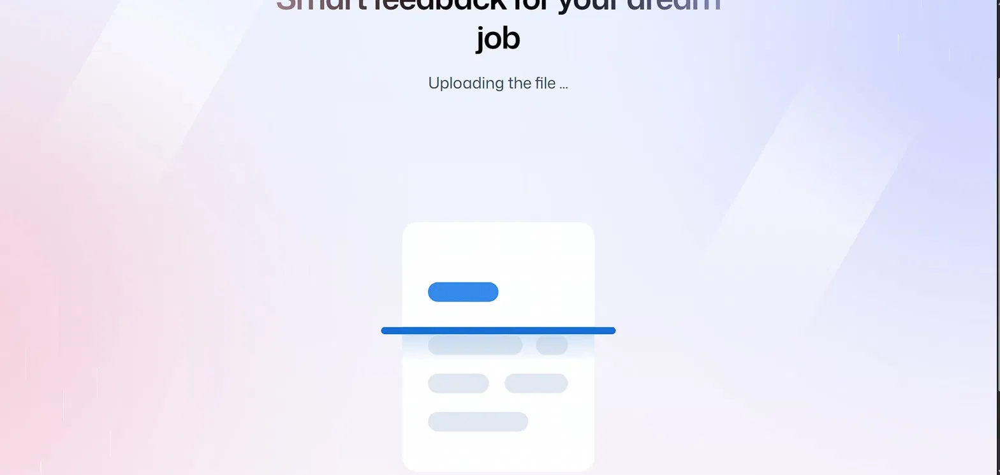
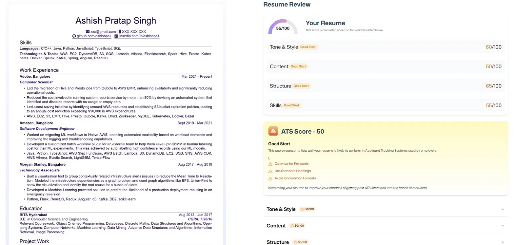
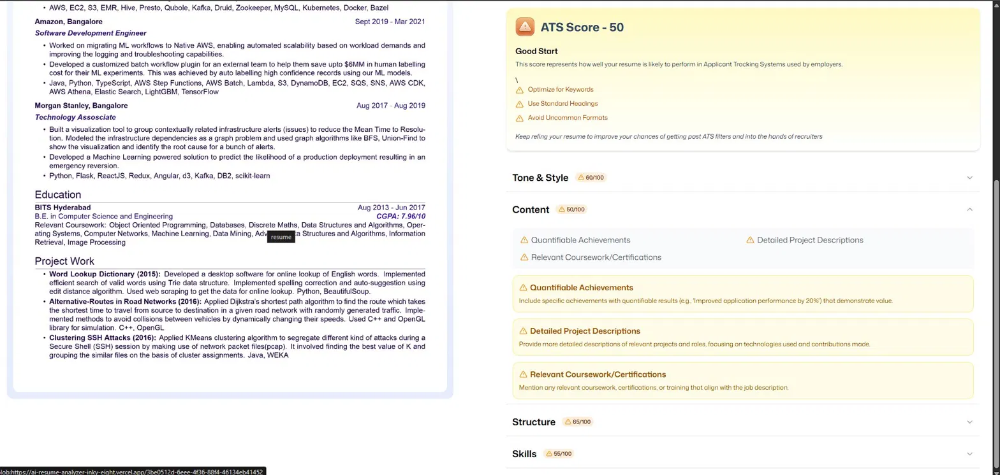

<div align="center">


<br/>
<br/>

# RESUMIND

### *AI-powered resume analysis. Zero backend. Zero friction.*

<p>
  
  
  
  
  
</p>

<p>
  
  
  
</p>

**[🚀 Live Demo](https://ai-resume-analyzer-inky-eight.vercel.app)** &nbsp;·&nbsp; **[📸 Screenshots](#-screenshots)** &nbsp;·&nbsp; **[⚙️ Getting Started](#-getting-started)**

</div>

---

## 🧠 What is RESUMIND?

**RESUMIND** is a fully client-side AI resume analyzer — no backend server, no database setup, no API keys to manage. Drop your resume PDF against any job description and get back a structured ATS score, section-by-section feedback, and specific improvement tips — all powered by GPT-4o-mini via Puter.js.

> Built with React 19, TypeScript, Tailwind CSS, and React Router — the entire stack (auth, file storage, AI, key-value database) runs through a single Puter.js integration with no custom backend whatsoever.

---

## ✨ Features

### 🔐 Auth System — Puter.js Native
Sign up or log in with a Puter account. Auth state is persisted automatically — the app redirects unauthenticated users to the login screen and remembers sessions across visits. Logout is handled via the `/auth` route.

### 📄 Resume Upload — Drag & Drop
Upload any PDF resume (up to 20 MB) via drag-and-drop or file picker. The file is sent to Puter's filesystem and passed directly to the AI — no intermediate server involved.

### 🤖 AI Analysis — GPT-4o-mini via Puter
The resume PDF alongside the company name, job title, and job description is analyzed by `gpt-4o-mini` through Puter.js's AI module. The AI returns a structured score breakdown across four dimensions:

| Dimension | What it checks |
|---|---|
| **Tone & Style** | Professional language, active voice, consistency |
| **Content** | Quantifiable achievements, relevant experience, project depth |
| **Structure** | Section ordering, heading clarity, ATS-friendliness |
| **Skills** | Keyword alignment with the target job description |

### 📊 ATS Score + Badges
Each section gets a score out of 100 and a badge — **Good**, **Good Start**, or **Needs Improvement** — so you know at a glance where you stand with Applicant Tracking Systems.

### 🖼️ Resume Preview
The uploaded PDF is converted to an image and displayed inline next to the AI feedback — no download needed to cross-reference improvements.

### 📋 Application Tracker Dashboard
Every submission is saved via Puter KV store to your personal dashboard. The home page shows all past analyses as cards — company name, role, and score — so you can track progress across multiple applications over time.

### 🐳 Docker Support
A `Dockerfile` is included for containerized deployment anywhere beyond Vercel.

---

## 📸 Screenshots

<table>
  <tr>
    <td align="center" width="50%">
      
      <br/><b>🏠 Home — Application Tracker Dashboard</b><br/>
      <sub>Past submissions with company, role, and ATS score at a glance</sub>
    </td>
    <td align="center" width="50%">
      
      <br/><b>📤 Upload — Resume Submission Form</b><br/>
      <sub>Company name · Job title · Job description · Drag & drop PDF</sub>
    </td>
  </tr>
  <tr>
    <td align="center" width="50%">
      
      <br/><b>⏳ Analyzing — AI Processing State</b><br/>
      <sub>File uploads to Puter FS, PDF converts to image, AI analysis runs</sub>
    </td>
    <td align="center" width="50%">
      
      <br/><b>📊 Results — Resume Review Panel</b><br/>
      <sub>Rendered resume on the left, ATS score + section scores on the right</sub>
    </td>
  </tr>
  <tr>
    <td align="center" width="50%">
      
      <br/><b>🔧 Improvements — Accordion Detail View</b><br/>
      <sub>Expandable sections with specific, actionable tips per score category</sub>
    </td>
    <td align="center" width="50%">
      
      <br/><b>🔐 Auth — Login / Logout via Puter</b><br/>
      <sub>One-click Puter auth — session persists across visits</sub>
    </td>
  </tr>
</table>

---

## 🔄 How It Works

```
User Opens App
      │
      ▼
┌─────────────────────┐
│   Puter.js Auth     │  ← Sign up / Log in  (/auth)
└──────────┬──────────┘
           │ Authenticated → redirect
           ▼
┌─────────────────────┐
│  Home Dashboard     │  ← Past submissions loaded from puter.kv  (/home)
└──────────┬──────────┘
           │ "Upload Resume" →
           ▼
┌─────────────────────┐
│   Upload Form       │  ← Company · Role · JD · PDF drag & drop  (/upload)
└──────────┬──────────┘
           │ "Analyze Resume" →
           ▼
  ┌────────────────────────────────────────┐
  │  puter.fs  →  Upload PDF to cloud      │
  │  pdftoimg  →  Convert PDF to image     │
  │  puter.ai  →  GPT-4o-mini inference   │
  └────────────────────┬───────────────────┘
                       │
                       ▼
┌──────────────────────────────────────────┐
│   Results Page  (/resume)                │
│  ┌───────────────┐  ┌───────────────────┐│
│  │ Resume Image  │  │ Overall ATS Score ││
│  │  (PDF→img)    │  │ Tone · Content    ││
│  │               │  │ Structure · Skills││
│  │               │  │ Improvement Tips  ││
│  └───────────────┘  └───────────────────┘│
└──────────────────────────────────────────┘
           │
           ▼
  Saved to puter.kv → Appears on Home Dashboard next visit
```

---

## 🏗️ Project Structure

```
AI-Resume-Analyzer/
├── app/
│   ├── components/
│   │   ├── Accordian.tsx      # Expandable improvement tip sections
│   │   ├── ATS.tsx            # ATS score card with status badge
│   │   ├── Details.tsx        # Per-section breakdown panel
│   │   ├── Fileuploader.tsx   # Drag & drop PDF upload component
│   │   ├── navbar.tsx         # Top navigation bar
│   │   ├── resumecard.tsx     # Dashboard card per submission
│   │   ├── ScoreBadge.tsx     # Good / Warning / Bad label badge
│   │   ├── Scorecircle.tsx    # Circular progress score indicator
│   │   ├── ScoreGauge.tsx     # Arc gauge for overall score display
│   │   └── Summary.tsx        # Score summary panel
│   │
│   ├── lib/
│   │   ├── puter.ts           # ✅ Central Puter.js config (auth · fs · kv · ai)
│   │   ├── pdftoimg.ts        # PDF → image conversion (PDF.js)
│   │   ├── utils.ts           # Shared helper functions
│   │   ├── UUid.ts            # Unique submission ID generator
│   │   └── accor.ts           # Accordion open/close state logic
│   │
│   ├── routes/
│   │   ├── auth.tsx           # /auth  — Puter login / logout screen
│   │   ├── home.tsx           # /home  — Application tracker dashboard
│   │   ├── upload.tsx         # /upload — Resume + JD submission form
│   │   └── resume.tsx         # /resume — AI feedback + resume preview
│   │
│   ├── routes.ts              # React Router route definitions
│   ├── root.tsx               # App root layout + providers
│   └── app.css                # Global styles
│
├── constants/
│   └── index.ts               # App-wide constants (AI prompt, config values)
│
├── types/
│   ├── index.d.ts             # Global TypeScript types
│   └── puter.d.ts             # Puter.js TypeScript declarations
│
├── public/
│   ├── images/                # Background SVGs + sample resume images
│   ├── icons/                 # ATS status SVG icons (good · warning · bad)
│   └── pdf.worker.min.mjs     # PDF.js web worker
│
├── Dockerfile
├── vite.config.ts
├── react-router.config.ts
└── tsconfig.json
```

---

## ⚙️ Puter.js — The Entire Backend

RESUMIND uses a single `lib/puter.ts` as the central config layer for all Puter.js features. There is no Express server, no Supabase, no Firebase — Puter replaces all of it.

| Puter Module | Used For |
|---|---|
| `puter.auth` | User sign-up, login, logout, session persistence |
| `puter.fs` | Resume PDF cloud upload and retrieval |
| `puter.ai` | GPT-4o-mini inference for full resume analysis |
| `puter.kv` | Saving and fetching past submissions per user |

> All Puter features are accessed via `lib/puter.ts` — import from there across the codebase rather than calling `puter.*` directly. This keeps the integration centralized, typed, and easy to swap out.

---

## 🚀 Getting Started

### Prerequisites
- Node.js 18+
- A free [Puter account](https://puter.com) — no credit card required

### Run Locally

```bash
# 1. Clone the repository
git clone https://github.com/YOURCODERAYAN/ai-resume-analyzer.git
cd ai-resume-analyzer

# 2. Install dependencies
npm install

# 3. Start the dev server
npm run dev
```

Open `http://localhost:5173` — that's it. No `.env` file needed. No API keys. Puter.js handles everything in the browser.

### Docker

```bash
docker build -t resumind .
docker run -p 3000:3000 resumind
```

---

## 📦 Tech Stack

| Category | Technology |
|---|---|
| **Framework** | React 19 |
| **Language** | TypeScript |
| **Styling** | Tailwind CSS |
| **Routing** | React Router v7 (file-based) |
| **AI Inference** | GPT-4o-mini via Puter.js |
| **Auth** | Puter.js Auth |
| **File Storage** | Puter.js FS |
| **Database** | Puter.js KV Store |
| **PDF Processing** | PDF.js (PDF → image conversion) |
| **Build Tool** | Vite |
| **Deployment** | Vercel + Docker |

---

## 🗺️ Roadmap

- [x] Puter.js auth — sign up / login / logout
- [x] Drag & drop PDF upload (max 20 MB)
- [x] GPT-4o-mini AI resume analysis
- [x] ATS score + section badges (Tone · Content · Structure · Skills)
- [x] PDF to image resume preview
- [x] Application tracker dashboard via Puter KV
- [x] Vercel deployment + Docker support
- [ ] Dedicated logout button in navbar
- [ ] Resume improvement diff view across versions
- [ ] Multiple saved resumes per job application
- [ ] Export full feedback as a PDF report
- [ ] Shareable public result links

---

## 🤝 Contributing

```bash
git checkout -b feature/your-feature
git commit -m "feat: describe your change"
git push origin feature/your-feature
# Then open a Pull Request
```

---

## 📄 License

MIT — free to use, fork, and build on.

---

<div align="center">

Built by **Ayan** &nbsp;·&nbsp; Powered by [Puter.js](https://puter.com) + GPT-4o-mini

[](https://ai-resume-analyzer-inky-eight.vercel.app)

*If this helped you, a ⭐ goes a long way.*

</div>
